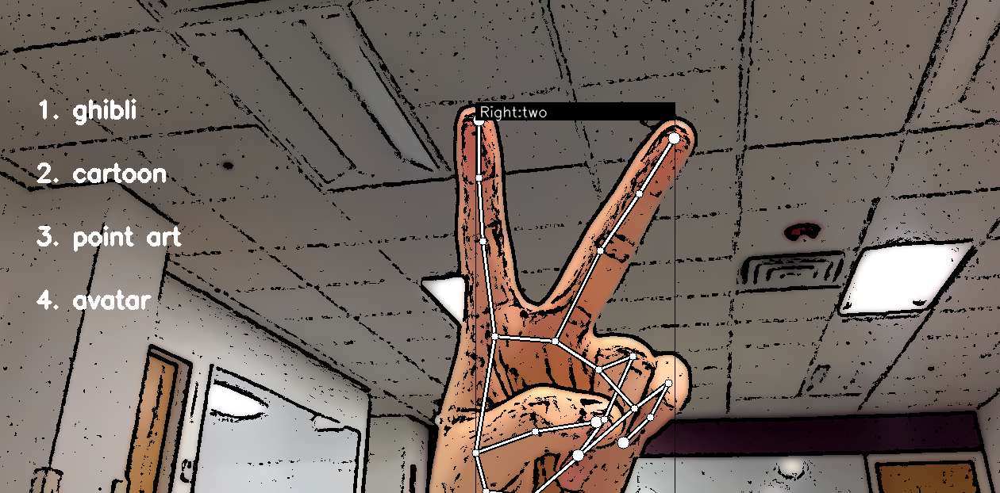
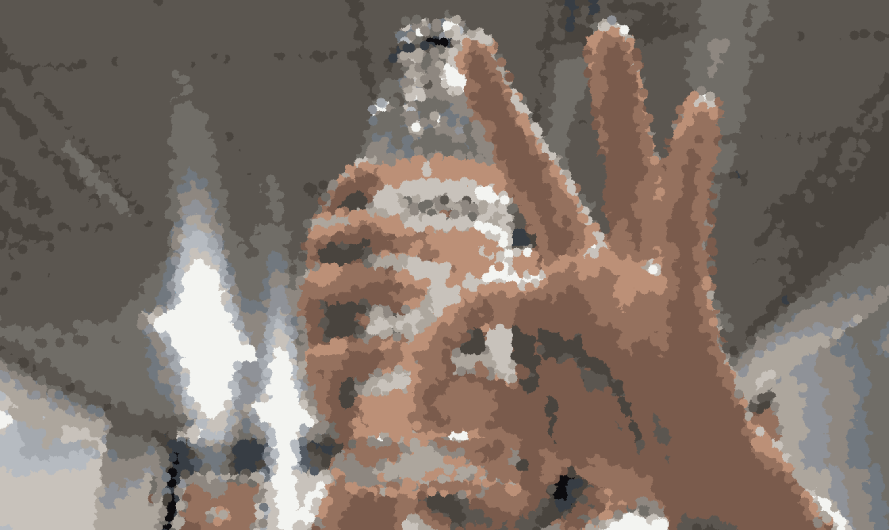
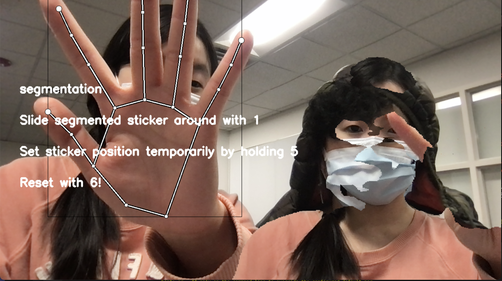
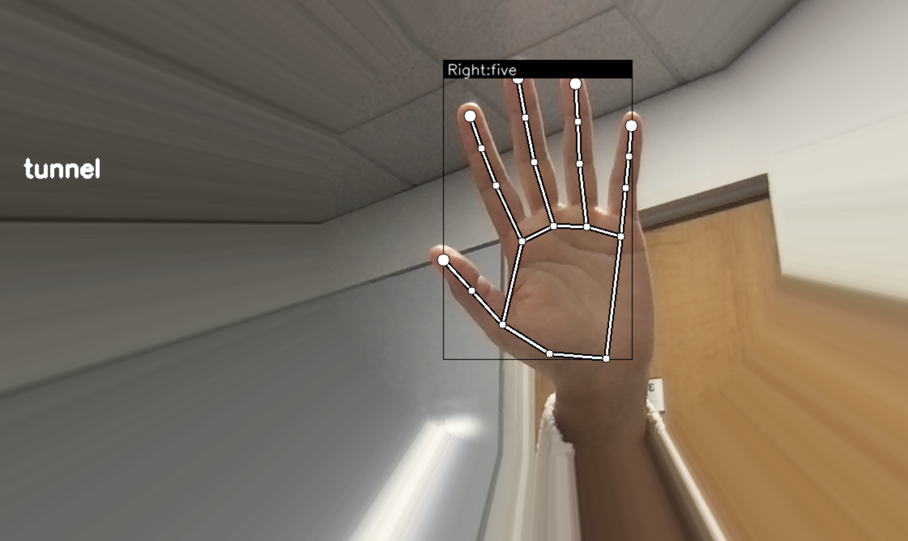

# Troupe: Gesture-Controlled Special Effects

## About
With simple gesture controls, users can create a myriad of augmented reality effects through their webcam. 

## Features
Some features include...
- 360 degree surround view
- Mural (style transfer)
- Cartoon filter
- Point art filter
- Segmentation (using PSPNet)
- Drawing
- Light tunnel

## Footage

## Setup
- run `./download.sh` in the project root to download assets and models
- run `pip install -r requirements.txt` inside your virtual environment 
- run `python3 app.py`

